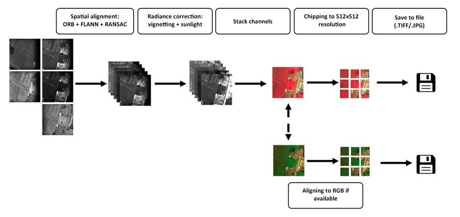

<div align="center">
  <p>
    <a href="https://icaerus.eu" target="_blank">
      </a>
    <h3 align="center"> Multispectral UAV Image calibration and alignment</h3>
    
   <p align="center">
    Python-based calibration procedures for DJI Mavic 3M, DJI Phantom 4 Multispectral, MicaSense Altum (-pt), RedEdge and Parrot Sequoia.
    <br/>
    <br/>
    <a href="https://github.com/icaerus-eu/msdata/wiki"><strong>Explore the wiki »</strong></a>
    <br/>
    <br/>
    <a href="https://github.com/icaerus-eu/msdata/issues">Report Bug</a>
    -
    <a href="https://github.com/icaerus-eu/msdata/issues">Request Feature</a>
  </p>
</p>
</div>

      

## Table Of Contents
- [Summary](#summary)
- [Installation](#installation)
- [Explanation](#explanation-of-alignment-and-radiometric-calibration)
- [License](#license)
- [Authors](#authors)
- [Acknowledgments](#acknowledgments)

## Summary
Calibration procedures for various Multispectral sensors and UAVs. Used to create the large, open, pretraining dataset MSUAV (link to dataset will follow).



This repository serves as a starting point to work with the raw images from your MS sensor. (Parrot Sequioa, DJI 3M, DJI Phantom 4MS, MicaSense Altum (-pt), MicaSense RedEdge) But it is not an exhaustive library for immediate import into your own projects.

There are various sensors calibration options here, from raw sensor to aligned image. Every notebook starts with the specific sensor used. Some datasets are built around an orthomosaic, which can be ignored for the purposes of learning the specific sensor alignment.

* `notebooks/mavic_3m.ipynb`
* `notebooks/phantom_4m.ipynb`
* `notebooks/altum.ipynb`
* `notebooks/rededge.ipynb`
* `notebooks/sequoia.ipynb`'


## Installation
First, install [Conda](https://docs.conda.io/projects/conda/en/latest/user-guide/install/index.html). Then create an environment called `msdata` like below:

```bash
conda create --name msdata jupyterlab opencv numpy pandas rioxarray pillow piexif matplotlib tifffile scikit-image
conda activate msdata
```


## Explanation of alignment and radiometric calibration


The provided code contains two important components for processing multispectral drone imagery: image alignment and radiance calculation.

Most code in the notebooks is scaffolding around loading the imagery as seperate bands, processing the specific folder/sensor structure and working with the EXIF tags for reading camera metadata. The core idea however is: 
1. Align spectral bands in space
2. Adjust DNs to radiance based on EXIF info

### Image Alignment

The `align_images` function is responsible for aligning different spectral bands of drone imagery. This alignment is necessary because multispectral cameras often have slight physical offsets between sensors for different wavelengths, resulting in misaligned images.

### How it works:

1. **Caching Previous Transformations**:
   - The function first checks if a transformation matrix has already been calculated and saved for this specific band combination.
   - This optimization prevents redundant calculations across multiple images from the same flight.

2. **Feature Detection and Matching**:
   - If no cached transformation exists, the function converts images to 8-bit and detects features using ORB (Oriented FAST and Rotated BRIEF).
   - Up to 50,000 keypoints and their descriptors are extracted from each image.
   - A FLANN-based matcher is used to find corresponding points between images.
   - The Lowe's ratio test (keeping matches where the best match is significantly better than the second-best) filters out poor matches.

3. **Transformation Calculation**:
   - Using the matched points, the function calculates an affine transformation matrix.
   - It uses RANSAC (Random Sample Consensus) to robustly estimate the transformation even in the presence of outliers.
   - The transformation is partial affine, allowing for rotation, translation, and uniform scaling.

4. **Image Warping**:
   - The second image is warped using the calculated transformation to align with the first image.
   - Linear interpolation is used during warping to maintain image quality.

This process ensures that pixels in different spectral bands correspond to the same physical locations on the ground, every sensor has a different location of the spectral image. alignment is based on the Green image.

### Radiance Calculation

The `irradiance` function converts raw digital numbers from drone images into calibrated reflectance values. This process, often called radiometric calibration, is crucial for obtaining scientifically meaningful measurements.

### Steps in the Process:

1. **Black Level Subtraction**:
   - The average "black level" value is subtracted from all pixel values.
   - This removes the sensor's dark current noise.
   - Negative values are clipped to zero, and values are normalized to the range [0,1].

2. **Exposure Time Normalization**:
   - Pixel values are divided by the exposure time.
   - This accounts for different exposure settings between images.

3. **Gain Correction**:
   - Values are multiplied by the sensor's band gain (equivalent to ISO settings in photography).
   - This standardizes the sensor response across different sensitivity settings.

4. **Irradiance Unit Scaling**:
   - Applies a scale factor to convert digital numbers to physical units of irradiance.

5. **Sunshine Sensor Correction**:
   - Extracts calibration measurements from the sunshine sensor.
   - Corrects for the black level in sunshine measurements.
   - Applies band-specific sensitivity corrections.

6. **Final Reflectance Calculation**:
   - Divides the pixel irradiance by the sunshine irradiance.
   - This normalized value represents reflectance - the proportion of light reflected by the surface.
   - Reflectance values are independent of illumination conditions, making them comparable across time and space.

This radiometric calibration process transforms raw sensor data into standardized reflectance values that can be directly compared across different flights, times of day, and atmospheric conditions - essential for scientific applications like agricultural monitoring, environmental assessment, and temporal change detection.

## License
Licensed under MIT License, see LICENSE file.

## Authors
* **Jurrian Doornbos** - *Wageningen University* - [Jurrian Doornbos](https://github.com/jurriandoornbos)

## Acknowledgments
This project is funded by the European Union, grant ID 101060643.


    